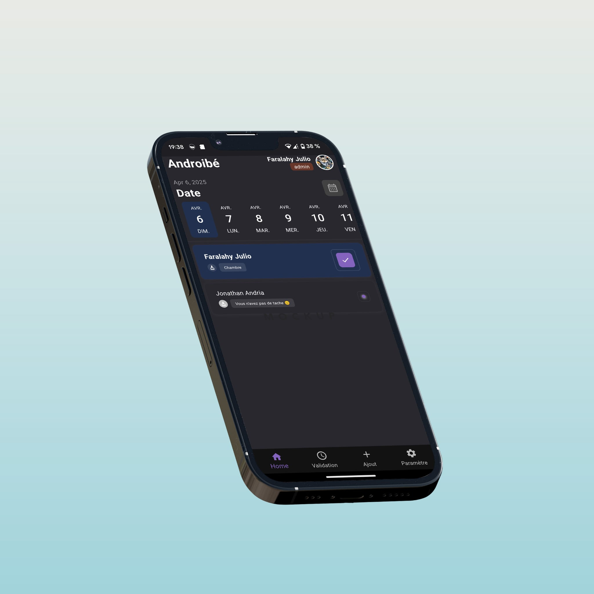

# DomestiK

**DomestiK** est une **application mobile collaborative de gestion des tâches ménagères**.  
Elle intègre un **algorithme de répartition automatique des tâches**, idéale pour la colocation ou la vie en communauté.

---

## 📌 Fonctionnalités principales

### ✅ Gestion des tâches quotidiennes
DomestiK simplifie l’organisation des tâches au sein d’un foyer ou d’un groupe de personnes.

### 🔄 Redistribution intelligente
Un algorithme permet à chaque utilisateur de savoir à l’avance s’il a une tâche assignée pour une date donnée.

### ✔️ Validation des tâches
- Une tâche ne peut être validée que par la personne à qui elle est assignée.
- Une fois validée, un autre membre peut la vérifier pour s’assurer de sa réalisation.

### 🚫 Gestion des imprévus
- Si un utilisateur est absent, l’administrateur peut temporairement désactiver son compte.
- L’algorithme redistribuera automatiquement les tâches restantes.

### 👥 Adaptabilité aux groupes
- Possibilité de créer plusieurs groupes.
- L’application ajuste automatiquement la répartition en fonction du nombre de membres.

### ⚖️ Gestion des surplus ou des manques
- Trop de tâches ? Certains auront plusieurs à faire.
- Pas assez ? Certains seront exemptés pour ce tour.

---

## 🛠 Autres fonctionnalités

- 🎨 Mode clair / sombre
- 🖼️ Changement de photo de profil
- 👑 Rôles administrateurs :
  - Création et gestion des foyers
  - Ajout / suppression de membres
  - Ajout / suppression de tâches
  - Attribution ou retrait des droits admin à un membre

---

